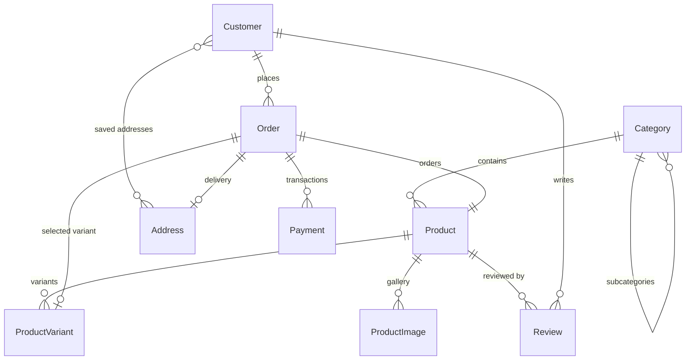

# djCommerce — Premium Gadgets & Mobile E-Commerce Web Application

<p align="center">
  
  
  
  
  
  
  
  
</p>

**djCommerce** is a responsive, full-featured Single-Vendor E-Commerce platform specializing in premium smartphones, tablets, smartwatches, audio devices, and tech accessories. Built with **Django 6.1**, **Bootstrap 5.3.3**, and **Vanilla JavaScript ES6+**, it includes **75 branded products** with multi-dimensional variant pricing (`Color | Storage | Region`), multi-angle image galleries, session-based cart, dual payment gateways (**Stripe** and **Cash on Delivery**), customer dashboard, and a fully customized Django Admin suite.

Developed per the requirements in [`Assignment_Single_Vendor_Ecommerce_Images.md`](./Assignment_Single_Vendor_Ecommerce_Images.md), satisfying all mandatory requirements plus bonus features.

---

## 📋 Table of Contents
- [Technology Stack](#technology-stack)
- [Key Features](#key-features)
- [Demo Credentials](#demo-credentials)
- [Installation & Setup](#installation--setup)
- [Automated Testing](#automated-testing)
- [Database Schema](#database-schema)
- [Directory Structure](#directory-structure)
- [Assignment Compliance](#assignment-requirements-compliance)

---

## 🛠️ Technology Stack

| Layer | Technology | Details |
| :--- | :--- | :--- |
| **Backend** | Django 6.1.1 | ORM, MTV architecture, auth, sessions, forms |
| **Language** | Python 3.12.10 | Core server-side runtime |
| **Database** | SQLite 3.49 | Pre-populated with products, variants, and users |
| **Frontend** | Bootstrap 5.3.3 | Responsive grid, cards, modals, forms |
| **Scripting** | JavaScript ES6+ | AJAX cart, dynamic variant switching, quantity steppers |
| **Payment** | Stripe SDK | Hosted Stripe Checkout with webhook handling |
| **Rich Text** | TinyMCE 6 | WYSIWYG specification editor in Django Admin |
| **Images** | Pillow 12.3.0 | Image validation, format normalization, gallery uploads |
| **Config** | python-dotenv 1.2.3 | `.env` management for secrets and API keys |

### Dependencies (`requirements.txt`)
```text
Django==6.1.1
Pillow==12.3.0
stripe==15.6.1
python-dotenv==1.2.3
requests==2.34.2
```

---

## ✨ Key Features

### 1. Homepage
- Sticky navbar with logo, category dropdown, live search suggestions, and AJAX cart badge.
- Bootstrap carousel banner, category bubble navigation, trust/value strip.
- **Featured Products**, **New Arrivals**, and **Best Offers & Deals** sections (8 curated products each).
- Contact form (`/#contact`) and store footer with social links and operating hours.

### 2. Product Catalog (`/products/`)
- 75 products across 6 categories and 14 smartphone brand subcategories.
- Filters: Category, Brand, Price Range, Availability (In Stock / Out of Stock).
- Sorting: Newest, Price Low–High, Price High–Low, Highest Discount, A–Z.
- Live AJAX search with thumbnail previews, paginated 12 per page.

### 3. Product Details Page
- High-resolution gallery with click-to-swap thumbnail strip.
- Variant pills (`Color | Storage | Region`) with instant JavaScript price and stock updates.
- TinyMCE-formatted specification table.
- 1–5 star customer reviews with yellow Bootstrap star icons.
- **Out of Stock Guard**: blocks adding unavailable items to cart; shows warning toast linking to `/#contact`.
- Recently Viewed sidebar via browser LocalStorage.

### 4. Shopping Cart
- Session-based, variant-aware cart — multiple variants of the same product tracked separately.
- Add, increase, decrease, remove, and clear cart operations.
- Real-time AJAX total recalculation with stock cap enforcement.

### 5. Checkout (Stripe & COD)
- **Stripe Checkout** — secure hosted payment in BDT with success/cancel webhook handling.
- **Cash on Delivery** — instant order with `Pending` status.
- Saved address selector (up to 3 addresses per customer).

### 6. Customer Dashboard
- Profile management (name, phone, avatar), password change, address book.
- Order history with status badges (`Pending`, `Paid`, `Processing`, `Shipped`, `Delivered`, `Cancelled`).
- Printable formal invoice per order.

### 7. Django Admin Customizations
- TinyMCE 6 embedded in the Specification field.
- Inline gallery image management (up to 10 photos per product).
- Separate `ProductVariant` table with default variant radio selector.
- Homepage curation tables: `FeaturedProduct`, `NewProduct`, `OfferProduct`.
- Email-first custom User Admin.

---

## 🗄️ Demo Credentials

The repository includes a pre-populated `db.sqlite3` and all product images. Clone and run immediately.

| Role | Username / Email | Password | Access |
| :--- | :--- | :--- | :--- |
| **Admin / Superuser** | `admin` / `admin@example.com` | `123456` | Full access to Django Admin Panel (`/admin/`) & Storefront |
| **Customer (Normal User)** | `customer` / `customer@example.com` | `123456` | Storefront shopping, cart, checkout & customer dashboard |
| **Customer (Normal User)** | `testuser` / `testuser@example.com` | `123456` | Storefront shopping, cart, checkout & customer dashboard |

---

## 🚀 Installation & Setup

### 1. Clone the Repository
```bash
git clone https://github.com/ArkaKarmoker/djCommerce.git
cd djCommerce
```

### 2. Create & Activate Virtual Environment

**Windows (PowerShell):**
```powershell
python -m venv venv
.\venv\Scripts\activate
```

**macOS / Linux:**
```bash
python3 -m venv venv
source venv/bin/activate
```

### 3. Install Dependencies
```bash
pip install -r requirements.txt
```

### 4. Environment Configuration *(Optional)*
Copy `.env.example` to `.env` for Stripe live payment testing:
```ini
SECRET_KEY=your-secret-key
DEBUG=True
STRIPE_PUBLISHABLE_KEY=pk_test_your_key
STRIPE_SECRET_KEY=sk_test_your_key
```
> The project runs out-of-the-box without `.env` using built-in development defaults.

### 5. Run the Server
```bash
python manage.py runserver
```

| Page | URL |
| :--- | :--- |
| Storefront | http://127.0.0.1:8000/ |
| Product Catalog | http://127.0.0.1:8000/products/ |
| Django Admin | http://127.0.0.1:8000/admin/ |

---

## 🧪 Automated Testing

```bash
python manage.py test
```

```
Ran 13 tests in 3.6s — OK
```

Covers: model properties, cart logic, variant pricing, checkout validation, and views.

---

## 📊 Database Schema



---

## 📁 Directory Structure

```text
djCommerce/
├── core/                    # Django project settings & root URL routing
├── media/
│   ├── products/            # Main product images
│   ├── product_images/      # Gallery images
│   └── profile/             # Customer avatars
├── shop/
│   ├── migrations/
│   ├── admin.py             # TinyMCE, inline gallery, custom UserAdmin
│   ├── cart.py              # Session-based variant-aware cart
│   ├── context_processors.py
│   ├── forms.py             # Checkout, Register, Review, Profile
│   ├── models.py            # Product, Variant, Order, Customer, Review, etc.
│   ├── tests.py             # 13 unit tests
│   ├── urls.py
│   └── views.py             # Catalog, cart, checkout, dashboard views
├── static/
│   ├── css/style.css        # Custom design tokens & storefront styles
│   └── js/main.js           # Toast, cart AJAX, variant logic
├── templates/
│   ├── base.html            # Sticky navbar, footer, toast system
│   └── shop/
│       ├── home.html
│       ├── product_list.html
│       ├── product_detail.html
│       ├── cart_detail.html
│       ├── checkout.html
│       ├── order_success.html
│       ├── dashboard.html
│       └── invoice.html
├── .env.example
├── db.sqlite3               # Pre-populated (75 products, 371 variants)
├── manage.py
├── README.md
└── requirements.txt
```

---

## 📋 Assignment Requirements Compliance

| Requirement | Implementation | Status |
| :--- | :--- | :---: |
| Home Page (logo, navbar, carousel, categories, featured, footer) | Custom logo, Bootstrap carousel, category bubbles, 8-product grids, footer | ✅ |
| Product Page (image, name, price, description, view & cart) | 75 products with BDT pricing, gallery, and instant cart action | ✅ |
| Product Details Page | Gallery, variant selector, spec table, stock badge, Add to Cart | ✅ |
| Shopping Cart (add, increase, decrease, remove, total) | Session cart with AJAX updates, stock cap, grand total | ✅ |
| Checkout (name, phone, address, save order, confirmation) | Validated form, address book, Order saved, confirmation page | ✅ |
| Database Models (Product, Customer, Order) | All 3 required + ProductVariant, ProductImage, Address, Payment, Review | ✅ |
| Django Admin Product Management | TinyMCE editor, inline gallery, variant table | ✅ |
| **Bonus:** Search | Live AJAX suggestions + catalog keyword filter | ✅ |
| **Bonus:** Category Filter | 6 parent categories + 14 brand subcategories | ✅ |
| **Bonus:** Login / Register | Email login, registration, profile, password change | ✅ |
| **Bonus:** Discounts | Regular vs offer price with % OFF badge and savings pill | ✅ |
| **Bonus:** Ratings | 1–5 star reviews with yellow Bootstrap icons | ✅ |
| **Bonus:** Order History | Dashboard with status badges and printable invoices | ✅ |
| **Bonus:** Online Payment | Stripe Checkout in BDT | ✅ |

---

## 📄 License
Developed for educational purposes. All product brand names belong to their respective trademark holders.
