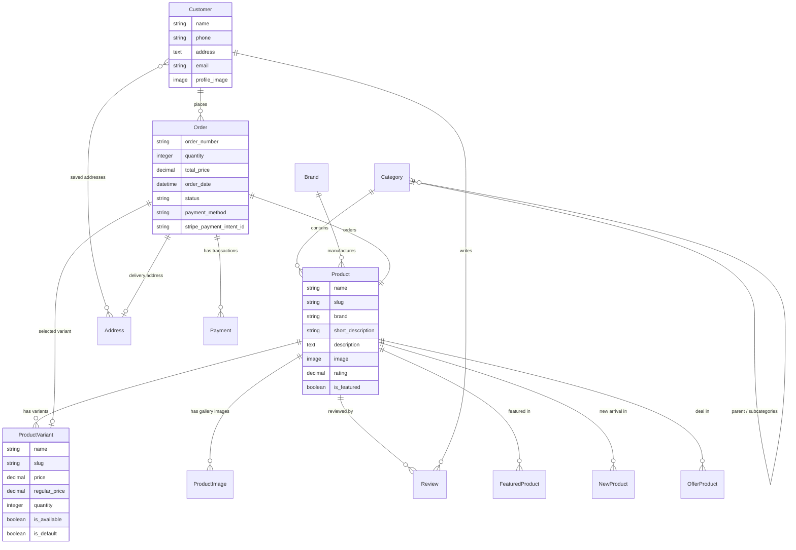

# djCommerce — Premium Gadgets & Mobile E-Commerce Web Application

<p align="center">
  
  
  
  
  
  
  
  
</p>

**djCommerce** is an enterprise-grade, responsive Single-Vendor E-Commerce web platform specializing in premium flagship smartphones, tablets, smartwatches, audio devices, and authentic tech accessories. Built with **Django 6.1**, **Bootstrap 5.3.3**, and **Vanilla JavaScript ES6+**, djCommerce is pre-populated with **75 realistic branded products** scraped directly from [Apple Gadgets BD](https://www.applegadgetsbd.com/) featuring multi-dimensional variant pricing (`Color | Storage | Region`), responsive technical specifications tables, multi-angle image galleries, automated session carts, dual checkout gateways (**Stripe Credit/Debit Card** and **Cash on Delivery**), customer dashboards, and a tailored Django administration suite.

This project was developed strictly according to the guidelines specified in [`Assignment_Single_Vendor_Ecommerce_Images.md`](./Assignment_Single_Vendor_Ecommerce_Images.md), satisfying all mandatory requirements and incorporating extensive bonus capabilities.

---

## 📋 Table of Contents
- [Project Overview](#-project-overview)
- [Technology Stack & Dependencies](#%EF%B8%8F-technology-stack--dependencies)
- [Key Features & System Capabilities](#-key-features--system-capabilities)
  - [1. Homepage & Curated Showcase Hub](#1-homepage--curated-showcase-hub)
  - [2. Comprehensive Product Catalog & Multi-Criteria Filtering](#2-comprehensive-product-catalog--multi-criteria-filtering)
  - [3. Product Details Page & Dynamic Multi-Attribute Variant Matrix](#3-product-details-page--dynamic-multi-attribute-variant-matrix)
  - [4. Full-Featured Variant-Aware Shopping Cart](#4-full-featured-variant-aware-shopping-cart)
  - [5. Dual-Gateway Checkout (Stripe & Cash on Delivery)](#5-dual-gateway-checkout-stripe--cash-on-delivery)
  - [6. Customer Dashboard & Self-Service Account Portal](#6-customer-dashboard--self-service-account-portal)
  - [7. Order Confirmation & Printable Invoice](#7-order-confirmation--printable-invoice)
  - [8. Advanced Django Admin Panel Customizations](#8-advanced-django-admin-panel-customizations)
  - [9. Real-World Web Scraping & Authentic Catalog Population](#9-real-world-web-scraping--authentic-catalog-population)
- [Sample Database & Demo Credentials](#-sample-database--demo-credentials)
- [Installation & Local Setup Guide](#-installation--local-setup-guide)
- [Automated Testing Suite](#-automated-testing-suite)
- [Database Schema & Data Models](#-database-schema--data-models)
- [Project Architecture & Directory Structure](#-project-architecture--directory-structure)
- [Assignment Requirements Compliance Matrix](#-assignment-requirements-compliance-matrix)

---

## 🌟 Project Overview

The objective of **djCommerce** is to provide an immersive, fluid e-commerce experience for both tech enthusiasts and store administrators. Built on Django's **Model-Template-View (MTV)** pattern, djCommerce separates presentation from domain logic, ensuring high maintainability, rapid page loads, and bulletproof transactional security.

Unlike basic e-commerce templates that use repetitive placeholder mock data, djCommerce features **75 real products** across 6 core categories and 14 smartphone brand subcategories. Each device includes multi-option variants with distinct pricing in Bangladeshi Taka (BDT), regular price strikethroughs, stock tracking, rich HTML specification tables edited via TinyMCE, and high-resolution photo galleries.

---

## 🛠️ Technology Stack & Dependencies

| Layer / Category | Technology | Purpose & Implementation Details |
| :--- | :--- | :--- |
| **Backend Framework** |  | Core web framework powering ORM, MTV architecture, authentication, sessions, and forms |
| **Programming Language** |  | Core server-side runtime |
| **Database Engine** |  | Relational database containing pre-populated realistic products, categories, variants, and users |
| **Frontend Framework** |  | Grid layout, responsive breakpoints, cards, modals, dropdowns, and form styling |
| **Frontend Scripting** |  | AJAX cart additions, dynamic variant switching, quantity steppers, and review star selectors |
| **Payment Gateway** |  | Global online payment processing with hosted Stripe Checkout and verified webhook handling |
| **Rich Text Editor** |  | Embedded HTML editor in the Django Admin for technical specification tables |
| **Image Processing** |  | Server-side image validation, format normalization (PNG/WebP to JPEG), and gallery uploads |
| **Environment Management** |  | Secure `.env` configuration for API keys, secret tokens, and debug flags |
| **Web Scraping Engine** |  | Automated scraping pipeline extracting Next.js RSC streams from Apple Gadgets BD |

### Top-Level Dependencies (`requirements.txt`)
```text
Django==6.1.1
Pillow==12.3.0
stripe==15.6.1
python-dotenv==1.2.3
requests==2.34.2
```

---

## ✨ Key Features & System Capabilities

### 1. Homepage & Curated Showcase Hub
- **Header & Navigation Bar**: Responsive sticky navbar with store logo, parent category dropdown, real-time live search suggestion box with thumbnail previews, live AJAX cart badge counter, and authenticated user dropdown.
- **Hero Carousel Banner**: High-definition promotional banners highlighting flagship arrivals, official brand warranties, and limited-time deals.
- **Trust & Value Strip**: 5 customer assurance points (Official Warranty, Guaranteed Authentic, 7-Day Replacement, Free Delivery, 24/7 Support).
- **Featured Categories Bubble Bar**: Visual category navigation shortcuts linking directly to filtered views with product counts.
- **Featured Products Showcase**: Curated flagship devices (iPhone 16 Pro Max, Galaxy S24 Ultra, iPad Pro M4, Pixel 9 Pro XL, Galaxy Z Fold6, Apple Watch Series 10, Sony WH-1000XM5, AirPods Pro 2) displayed in an 8-card responsive grid.
- **New Arrivals Showcase**: Curated latest hardware releases (iPhone 16, Galaxy Z Flip6, Pixel 9 Pro, OnePlus 15R, DJI Osmo Pocket 3, Galaxy Watch Ultra, Nothing Phone 3, Honor Magic8 Pro).
- **Best Offers & Deals Showcase**: Top discounted products featuring dynamic `% OFF` badges, regular price strikethroughs, and cash savings pills.
- **Interactive Contact Form**: Direct client feedback form that dispatches inquiries and auto-scrolls via `/#contact`.
- **SEO & Store Footer**: Store operating hours, physical pickup location in Dhaka, social links, newsletter signup, and accepted payment badge icons.

### 2. Comprehensive Product Catalog & Multi-Criteria Filtering
- **Catalog Route (`/products/`)**: Displays live products loaded directly from the database with clean pagination (12 products per page).
- **Category & Subcategory Filtering**:
  - Filter by parent category (`smart-phone`, `tablet`, `audio`, `smart-watch`, `accessories`, `gadgets`).
  - Filter by smartphone brand subcategories (`smart-phone-apple`, `smart-phone-samsung`, `smart-phone-google`, `smart-phone-honor`, `smart-phone-huawei`, `smart-phone-motorola`, `smart-phone-nothing`, `smart-phone-nokia`, `smart-phone-oneplus`, `smart-phone-realme`, `smart-phone-oppo`, `smart-phone-vivo`, `smart-phone-others`).
- **Brand Filter**: Instant filter by manufacturer brand name.
- **Price Range Filter**: Min/Max price filters in BDT.
- **Availability Filter**:
  - **All**: Shows complete catalog.
  - **In Stock**: Evaluates active variant inventory and displays all available products.
  - **Out of Stock**: Strictly displays discontinued or unstocked concept models without leaking in-stock products.
- **Multi-Mode Sorting**:
  - *Default* (Newest additions first)
  - *Price: Low to High*
  - *Price: High to Low*
  - *Highest Discount*
  - *Alphabetical (A–Z)*
- **Live Search Suggestions (`/api/search-suggest/`)**: Real-time debounce search returning matching titles, brands, categories, prices, and thumbnails as you type.

### 3. Product Details Page & Dynamic Multi-Attribute Variant Matrix
- **Photo Gallery with Interactive Swapping**: High-resolution main display with a thumbnail strip supporting click-to-swap viewing.
- **Combined Variant Options (`Color | Storage | Region`)**:
  - Seamless pill buttons representing combined multi-attribute options (e.g. `Desert Titanium | 256GB | SG / UAE` vs `Black Titanium | 1TB | AUS`).
  - Expanding `+ more` toggle for products with more than 6 variant combinations.
  - Instant JavaScript state updates: Clicking a variant updates selling price, regular price, stock status, and form inputs without reloading the page.
- **Technical Specification Table**: Formatted HTML specification tables displaying Processor, Display, Camera, Battery, Charging, Network, and OS details edited through TinyMCE.
- **Verified Customer Reviews & Interactive Star Rating**:
  - 1–5 Star Rating dropdown with custom Bootstrap yellow stars (`bi-star-fill`).
  - Customer review submission form with instant database storage and live average rating recalculation.
- **Out of Stock Pre-Order Guard**:
  - If a user clicks **Add to Cart** or **Shop Now** on an out-of-stock item, the cart does not falsely accept it.
  - A modern warning toast pops up with: **"Product is not available. Contact us for pre order."** and an action button linking directly to `/#contact`.
- **Recently Viewed Items Sidebar**: Client-side LocalStorage tracker displaying previously viewed gadgets.

### 4. Full-Featured Variant-Aware Shopping Cart
- **Session-Based Cart (`shop/cart.py`)**: Persistent shopping cart stored securely in the user session (`cart_session`).
- **Variant Discrimination**: Supports multiple distinct variants of the same product as separate line items (e.g. iPhone 16 128GB Black and iPhone 16 256GB Desert).
- **Cart Operations**:
  - Add to cart with quantity selection.
  - Increase item quantity (`+`).
  - Decrease item quantity (`-`).
  - Remove line item completely.
  - Clear entire cart (`/cart/clear/`).
- **Live Asynchronous Updates**: Real-time AJAX recalculation of item subtotal, cart total, delivery fees, and navbar badge count.
- **Stock Cap Protection**: Automatically caps cart quantities at the available physical inventory.

### 5. Dual-Gateway Checkout (Stripe & Cash on Delivery)
- **Stripe Credit/Debit Card Checkout**:
  - Creates a live Stripe Checkout Session configured in BDT (Bangladeshi Taka).
  - Secure redirect to Stripe's hosted payment portal.
  - Webhook and callback handling (`/stripe/success/` and `/stripe/cancel/`) recording Stripe Payment Intent IDs and updating order statuses to `Paid`.
- **Cash on Delivery (COD)**:
  - Instant order creation with `Pending` payment status for door-to-door delivery.
- **Address Book Integration**:
  - Customers can save up to 3 structured delivery addresses in their profile.
  - One-click saved address selector autofills the checkout form.

### 6. Customer Dashboard & Self-Service Account Portal
- **Profile Management**: View and edit name, phone number, and avatar image.
- **Address Book**: Add, edit, delete, and set default shipping addresses.
- **Order History**: Comprehensive table of all past orders with status badges (`Pending`, `Paid`, `Processing`, `Shipped`, `Delivered`, `Cancelled`).
- **Security**: Password change form with Django authentication hash updates.

### 7. Order Confirmation & Printable Invoice
- **Order Success Page (`/order-success/<order_number>/`)**: Displayed immediately after checkout with the confirmation message **"Order Placed Successfully!"** and order tracking number.
- **Printable Formal Invoice (`/dashboard/orders/<order_number>/invoice/`)**: Printable, clean invoice containing itemized breakdown, tax/delivery calculation, customer billing details, and official djCommerce branding.

### 8. Advanced Django Admin Panel Customizations
- **TinyMCE 6 Integration**: Integrated via CDN for the Product `description` ("Specification") field with table formatting tools.
- **Inline Gallery Management (`ProductImageInline`)**: Upload up to 10 gallery photos directly inside the Product edit screen without a separate sidebar table.
- **ProductVariant Separate Admin Table**: Dedicated table for variants with product selector, name, price, regular price, quantity, availability, and default radio selector.
- **Single Default Variant Enforcement**: Overridden model `save()` ensuring that selecting a default variant unsets all others for that product.
- **Curated Homepage Tables**: Dedicated admin interfaces for `FeaturedProduct`, `NewProduct`, and `OfferProduct` with display order controls.
- **Email-Based Custom User Admin**: Replaced default username-centric user admin with email-first columns, `is_admin`, `is_active`, and staff badges.

### 9. Real-World Web Scraping & Authentic Catalog Population
- **Automation Pipeline (`scripts/scrape_and_populate.py`)**:
  - Connects to [Apple Gadgets BD](https://www.applegadgetsbd.com/) and parses Next.js React Server Component (RSC) streams.
  - Extracts genuine product titles, brand metadata, and full HTML specification matrices.
  - Downloads authentic multi-angle PNG/WebP media, converts them into quality JPEGs, and stores them under `media/products/` and `media/product_images/`.
  - Combines individual Color, Storage, and Regional SKU parameters into unified variant definitions.
  - Normalizes stock inventory and sets accurate market prices.

---

## 🗄️ Sample Database & Demo Credentials

The repository includes a fully populated **SQLite Database** (`db.sqlite3`) and all original device photos under `media/`. You can run the application immediately upon cloning without running manual imports.

### Demo User Accounts:

| Role | Username / Email | Password | Access Details |
| :--- | :--- | :--- | :--- |
| **Superuser / Admin** | `admin` (`admin@example.com`) | `admin123` | Full access to Django Admin Panel (`http://127.0.0.1:8000/admin/`) |
| **Demo Customer 1** | `testbuyer` (`testbuyer@example.com`) | `Password123` | Customer account with order history, address book, and profile |
| **Demo Customer 2** | `abcd` (`wxyzabcd850@gmail.com`) | `123456` | Customer account with existing orders |

---

## 🚀 Installation & Local Setup Guide

Follow these simple steps to run djCommerce locally:

### 1. Prerequisites
- **Python 3.10+** (Tested on Python **3.12.10**) installed.
- **Git** installed on your system.

### 2. Clone the Repository
```bash
git clone https://github.com/ArkaKarmoker/djCommerce.git
cd djCommerce
```

### 3. Create & Activate Virtual Environment

#### On Windows (PowerShell):
```powershell
python -m venv venv
.\venv\Scripts\activate
```

#### On macOS / Linux:
```bash
python3 -m venv venv
source venv/bin/activate
```

### 4. Install Dependencies
```bash
pip install -r requirements.txt
```

### 5. Environment Configuration (Optional)
A `.env.example` file is included in the project root. The project runs out-of-the-box with built-in development defaults. To test live Stripe payments, copy `.env.example` to `.env` and insert your test keys:
```ini
SECRET_KEY=your-custom-secret-key-here
DEBUG=True
STRIPE_PUBLISHABLE_KEY=pk_test_your_key
STRIPE_SECRET_KEY=sk_test_your_key
```

### 6. Apply Migrations (Optional)
The pre-populated `db.sqlite3` is included. If you wish to apply any pending migrations:
```bash
python manage.py migrate
```

### 7. Run the Development Server
```bash
python manage.py runserver
```

Open your browser and navigate to:
- **Customer Storefront**: [http://127.0.0.1:8000/](http://127.0.0.1:8000/)
- **Product Catalog**: [http://127.0.0.1:8000/products/](http://127.0.0.1:8000/products/)
- **Django Admin Panel**: [http://127.0.0.1:8000/admin/](http://127.0.0.1:8000/admin/)

---

## 🧪 Automated Testing Suite

The repository includes a comprehensive unit test suite powered by Django's `TestCase` covering model methods, properties, cart calculations, checkout validation, variant pricing delegates, and views.

Run all unit tests:
```bash
python manage.py test
```

Expected Output:
```text
Creating test database for alias 'default'...
.............
----------------------------------------------------------------------
Ran 13 tests in 3.692s

OK
Destroying test database for alias 'default'...
```

---

## 📊 Database Schema & Data Models



---

## 📁 Project Architecture & Directory Structure

```text
djCommerce/
├── core/                               # Django Project Settings & Root Routing
│   ├── __init__.py
│   ├── asgi.py
│   ├── settings.py                     # App configs, Stripe, TinyMCE, Sessions
│   ├── urls.py                         # Master URL routing
│   └── wsgi.py
├── media/                              # User & Scraped Uploaded Media
│   ├── product_images/                 # Multi-angle gallery images (45+ devices)
│   ├── products/                       # Primary product showcase images
│   └── profile/                        # Customer profile pictures
├── scripts/                            # Catalog Automation & Scraping Scripts
│   └── scrape_and_populate.py          # Apple Gadgets BD RSC extraction pipeline
├── shop/                               # Core Domain Application
│   ├── migrations/                     # Database migration history (0001 - 0008)
│   ├── admin.py                        # TinyMCE 6, ProductVariantInline, UserAdmin
│   ├── apps.py                         # Shop configuration
│   ├── cart.py                         # Session-based variant-aware shopping cart
│   ├── context_processors.py           # Global cart badge & parent categories context
│   ├── forms.py                        # Checkout, Register, Review, Profile forms
│   ├── models.py                       # Domain models (Product, Variant, Order, etc.)
│   ├── tests.py                        # 13 automated unit tests
│   ├── urls.py                         # Shop URL endpoints
│   └── views.py                        # Catalog, PDP, cart, checkout, dashboard views
├── static/                             # Static Assets
│   ├── css/
│   │   ├── admin_custom.css            # Custom Django Admin panel styling
│   │   └── style.css                   # Storefront custom design tokens & glassmorphism
│   └── js/
│       ├── admin_tinymce.js            # TinyMCE CDN initialization script
│       └── main.js                     # Storefront JS (toast, stepper, cart interactions)
├── templates/                          # Django HTML Templates
│   ├── base.html                       # Global layout, sticky navbar, footer, toast container
│   ├── admin/                          # Admin customization templates
│   └── shop/                           # Domain templates
│       ├── home.html                   # Homepage (Hero, Featured, New, Offers, Contact)
│       ├── product_list.html           # Catalog page with filter sidebar & pagination
│       ├── product_detail.html         # PDP with variant pills, gallery, specs, reviews
│       ├── cart_detail.html            # Shopping cart overview
│       ├── checkout.html               # Checkout form with Stripe & COD selectors
│       ├── order_success.html          # Order confirmation page
│       ├── order_lookup.html           # Public order tracking by reference number
│       ├── login.html                  # Customer login page
│       ├── register.html               # Customer registration page
│       ├── dashboard.html              # Customer account & order history portal
│       ├── profile_edit.html           # Profile details editor
│       ├── password_change.html        # Password updater
│       ├── address_form.html           # Shipping address editor
│       └── invoice.html                # Printable formal order invoice
├── .env.example                        # Template for environment credentials
├── .gitignore                          # Configured to preserve db.sqlite3 & media/
├── Assignment_Single_Vendor_Ecommerce_Images.md  # Official specification document
├── db.sqlite3                          # Complete pre-populated database (75 products)
├── manage.py                           # Django CLI executive script
├── README.md                           # Project documentation
└── requirements.txt                    # Top-level dependencies with explicit versions
```

---

## 📋 Assignment Requirements Compliance Matrix

| Assignment Requirement | Required Element | Implementation in djCommerce | Status |
| :--- | :--- | :--- | :---: |
| **1. Shop Type** | Single vendor shop selection | High-tech **Mobile & Gadgets Shop** | ✅ Implemented |
| **2. Home Page** | Logo, Navbar, Carousel, Categories, Featured Products, Footer | Custom SVG logo, responsive navbar, Bootstrap carousel, bubble categories, 8 featured flagships, SEO footer | ✅ Implemented |
| **3. Product Page** | At least 5 products with image, name, price, short description, details, add to cart | **75 authentic products** loaded from SQLite with real BDT pricing, specifications, and instant action buttons | ✅ Implemented |
| **4. Product Details Page** | Image, name, price, description, available quantity, add to cart button | High-res gallery swapper, title, dynamic variant selector, specs table, live stock pill, Add to Cart | ✅ Implemented |
| **5. Shopping Cart** | Add to cart, increase/decrease qty, remove item, calculate total price | Session cart (`Cart` class) supporting multi-variants, AJAX qty stepper, line deletion, grand total recalculation | ✅ Implemented |
| **6. Checkout Page** | Customer name, phone, address form, database saving, order confirmation | Validated checkout form, saved address selector, saves `Order` model, shows **"Order Placed Successfully!"** | ✅ Implemented |
| **7. Database Models** | `Product`, `Customer`, `Order` models with required fields | Implemented `Product`, `Customer`, `Order` + extended with `ProductVariant`, `ProductImage`, `Address`, `Payment`, `Review` | ✅ Implemented |
| **8. Django Admin** | Product management via Django Admin | Customized Admin with **TinyMCE 6 editor**, inline photo gallery, and separate variant table | ✅ Implemented |
| **9. Bonus: Search** | Product keyword search | Live AJAX search suggestions in navbar + catalog query filter across name, brand, description | ✅ Implemented |
| **10. Bonus: Category Filter** | Multi-category filtering | Parent category filters + 14 smartphone brand subcategory filters | ✅ Implemented |
| **11. Bonus: Authentication** | Login and Register system | Customer Registration, Email/Username Login, Profile edit, and session logout | ✅ Implemented |
| **12. Bonus: Discounts** | Product discount support | Regular Price vs Offer Price calculation with dynamic `% OFF` and cash savings badges | ✅ Implemented |
| **13. Bonus: Ratings & Reviews** | Product star rating system | 1–5 Star Rating system with verified customer reviews and custom yellow Bootstrap star icons | ✅ Implemented |
| **14. Bonus: Order History** | Customer past orders view | Dashboard portal with status badges, itemized order logs, and printable invoices | ✅ Implemented |
| **15. Bonus: Online Payment** | Payment gateway integration | **Stripe Checkout** gateway handling credit/debit cards in BDT | ✅ Implemented |

---

## 📄 License & Attribution
This project was developed for educational and demonstration purposes under the assignment guidelines of the **Single Vendor E-Commerce Project**. All product brand names, specifications, and media referenced belong to their respective trademark holders.
